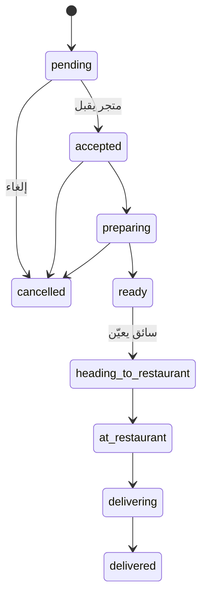

# Souq — دليل تنفيذ تطبيق الأدمن (Handoff كامل)

> **الغرض:** مرجع واحد لمطوّر تطبيق الأدمن (Flutter / Web / React) لبدء التنفيذ دون الحاجة لاستكشاف مشروع العميل يدويًا.  
> **المصدر:** مراجعة مشروع `SouqCustomer-main` (تطبيق العميل) + وثائق الـ API المرفقة.  
> **آخر تحديث:** 2026-05-17  
> **إصدار تطبيق العميل:** `1.0.3+17` (`pubspec.yaml`)

---

## الفهرس

1. [نظرة على المنظومة](#1-نظرة-على-المنظومة)
2. [البنية التقنية والاتصال بالـ API](#2-البنية-التقنية-والاتصال-بال-api)
3. [المصادقة وعزل الحسابات](#3-المصادقة-وعزل-الحسابات)
4. [كتالوج Endpoints الموجودة (مشتركة)](#4-كتالوج-endpoints-الموجودة-مشتركة)
5. [Endpoints مقترحة لتطبيق الأدمن](#5-endpoints-مقترحة-لتطبيق-الأدمن)
6. [نماذج البيانات (JSON)](#6-نماذج-البيانات-json)
7. [دورة حياة الطلب](#7-دورة-حياة-الطلب)
8. [وحدات الشاشات المقترحة للأدمن](#8-وحدات-الشاشات-المقترحة-للأدمن)
9. [ما يديره الأدمن من ميزات تطبيق العميل](#9-ما-يديره-الأدمن-من-ميزات-تطبيق-العميل)
10. [Geofencing ومنطقة الخدمة](#10-geofencing-ومنطقة-الخدمة)
11. [الدفع والكوبونات والولاء](#11-الدفع-والكوبونات-والولاء)
12. [الإشعارات و WebSocket](#12-الإشعارات-و-websocket)
13. [رفع الصور (Cloudflare R2)](#13-رفع-الصور-cloudflare-r2)
14. [إعدادات إصدار التطبيق (Force Update)](#14-إعدادات-إصدار-التطبيق-force-update)
15. [ثوابت المنصة والدعم](#15-ثوابت-المنصة-والدعم)
16. [ملفات مرجعية داخل المشروع](#16-ملفات-مرجعية-داخل-المشروع)
17. [خطة MVP وترتيب التنفيذ](#17-خطة-mvp-وترتيب-التنفيذ)
18. [Checklist قبول](#18-checklist-قبول)

---

## 1. نظرة على المنظومة

منصة **Souq** للتوصيل والتجارة المحلية تتكون من عدة تطبيقات تتشارك نفس الـ Backend:

| التطبيق | `user_type` | الدور |
|---------|-------------|--------|
| **Customer** (هذا المشروع) | `customer` | طلب طعام/منتجات، P2P توصيل، مفضلة، ولاء |
| **Restaurant / Merchant** | `restaurant` / `vendor` / `pharmacy` / `supermarket` | إدارة المتجر، المنيو، طلبات المتجر |
| **Driver / Rider** | `driver` | قبول الطلبات، التتبع، الأرباح |
| **Admin** (مطلوب تنفيذه) | `admin` | إدارة المنصة بالكامل |

**منطقة الخدمة الافتراضية:** مصر — دقهلية / ذكرنس (انظر `AppConstants.companyAddressAr`).  
**Geofencing:** الطلبات خارج منطقة الخدمة تُرفض بـ `400` من السيرفر.

### أنواع البائعين (`vendor_type`)

| القيمة | الاستخدام |
|--------|-----------|
| `restaurant` | مطاعم |
| `pharmacy` | صيدليات |
| `supermarket` | سوبرماركت |

يظهر في تطبيق العميل كفلاتر في الرئيسية (`/restaurants?type=pharmacy`).

### أنواع الطلبات

| `order_type` | الوصف |
|--------------|--------|
| `vendor` | طلب من متجر (مطعم/صيدلية/سوبرماركت) عبر `POST /order/checkout` |
| `p2p` | توصيل من نقطة لنقطة عبر `POST /order/p2p/checkout` |

---

## 2. البنية التقنية والاتصال بالـ API

### عناوين السيرفر

| الإعداد | القيمة الحالية |
|---------|----------------|
| Base URL | `https://souq-917s.onrender.com` |
| API Path | `/servy` |
| API Version | `v1` |
| **Full API Base** | `https://souq-917s.onrender.com/servy/api/v1` |

> **ملاحظة:** السيرفر على Render (Free Tier) — استخدم **timeout 60 ثانية** كما في تطبيق العميل.

### Headers إلزامية

```
Accept: application/json
Content-Type: application/json
Authorization: Bearer {access_token}   // للمسارات المحمية
Idempotency-Key: {uuid}                // عند checkout فقط (منع تكرار الطلب)
```

### شكل الاستجابة

التطبيق يتعامل مع:

- مصفوفة مباشرة: `[{ ... }]`
- مغلّف: `{ "success": true, "data": [...] }` أو `{ "data": { ... } }`

**للأدمن:** يُفضّل توحيد envelope واحد من الباكند. القوائم الفارغة → **200** مع `[]` وليس 404.

### Stack مقترح لتطبيق الأدمن

| الطبقة | اقتراح (مرن) |
|--------|----------------|
| Mobile | Flutter + Riverpod + Dio + go_router (مثل العميل) |
| Web | React/Vue + نفس Dio/axios |
| خرائط | Google Maps (مفاتيح موجودة في `app_constants.dart`) |
| إشعارات | Firebase Cloud Messaging (مثل العميل) |
| جداول/تقارير | DataTable + تصدير CSV |

**مرجع التنفيذ في العميل:** `lib/core/api/api_client.dart` — interceptors للتوكن وتحديثه.

---

## 3. المصادقة وعزل الحسابات

### عزل الحسابات per-app

نفس البريد/الهاتف يمكن أن يكون له **حسابات منفصلة** حسب `user_type`.  
**كل طلب auth يجب أن يرسل `user_type` أو `app`.**

| Endpoint | الحقل | مطلوب |
|----------|-------|-------|
| `POST /user/signup` | `user_type` | نعم |
| `POST /user/signin` | `user_type` | نعم |
| `POST /accounts/sso` | `user_type` | نعم |
| `POST /user/forgot-password` | `app` | نعم عمليًا |
| `POST /user/verify-reset-code` | `app` | نعم |

**لتطبيق الأدمن:** ثبّت ثابتًا:

```dart
const kAdminUserType = 'admin';
```

### تسجيل دخول الأدمن (مقترح)

```
POST /admin/signin
{
  "email": "admin@souqegy.net",
  "password": "********"
}
```

أو استخدام `POST /user/signin` مع `"user_type": "admin"` إذا الباكند يدعمه.

### أخطاء auth الشائعة

| HTTP | الخطأ | المعنى |
|------|-------|--------|
| 400 | `user type is required` | نسيان `user_type` |
| 400 | `invalid user type` | قيمة غير مسموحة |
| 401 | `invalid credentials` | بيانات خاطئة أو `user_type` لا يطابق الحساب |
| 409 | `user already exists` | تعارض ضمن نفس `user_type` |

### Refresh / Logout

| Endpoint | Method | ملاحظات |
|----------|--------|---------|
| `/user/refresh` | POST | تجديد التوكن |
| `/user/logout` | POST | إبطال التوكن (Redis blacklist) |

**مرجع:** `flutter-user-type-isolation.md` · `AUTH_IMPLEMENTATION_GUIDE.md`

---

## 4. كتالوج Endpoints الموجودة (مشتركة)

المصدر: `lib/core/constants/api_constants.dart` — كل المسارات أدناه نسبية من `{apiBaseUrl}`.

### 4.1 عام / إعدادات

| Method | Path | الوظيفة | Auth |
|--------|------|---------|------|
| GET | `/app/version-config` | إجبار التحديث | لا |

### 4.2 المصادقة والمستخدم

| Method | Path | الوظيفة |
|--------|------|---------|
| POST | `/user/signin` | تسجيل دخول |
| POST | `/user/signup` | تسجيل |
| POST | `/user/logout` | خروج |
| POST | `/user/refresh` | تجديد توكن |
| GET/PUT | `/user/profile` | بروفايل |
| PUT | `/user/update-password` | تغيير كلمة المرور |
| POST | `/user/forgot-password` | نسيت كلمة المرور |
| POST | `/user/verify-reset-code` | تحقق OTP |
| POST | `/user/reset-password` | إعادة تعيين |
| POST | `/accounts/sso` | Google / Apple |
| POST | `/auth/start-verification` | Akedly OTP |
| GET | `/auth/verification-status` | حالة التحقق |
| GET | `/user/loyalty` | رصيد الولاء |
| GET | `/user/loyalty/history` | سجل الولاء |
| POST | `/loyalty/redeem/preview` | معاينة استبدال نقاط |
| GET/POST | `/user/addresses` | عناوين |
| GET/PUT/DELETE | `/user/addresses/:id` | عنوان واحد |
| GET/POST/DELETE | `/user/favorites` | مفضلة متاجر |
| DELETE | `/user/favorites/:restaurantId` | إزالة مفضلة |

### 4.3 المطاعم / المتاجر (عميل + عام)

| Method | Path | الوظيفة |
|--------|------|---------|
| GET | `/restaurants` | قائمة (بحث، فلترة، `type`) |
| GET | `/restaurants/:id` | تفاصيل |
| GET | `/restaurants/:id/menu` | المنيو |
| GET | `/restaurants/:id/reviews` | مراجعات |
| GET | `/restaurants/:id/statistics` | إحصائيات المتجر |
| PUT | `/restaurants/:id/status` | فتح/إغلاق |
| PUT | `/restaurants/:id/online-status` | online/offline |
| GET | `/restaurants/featured` | مميزة |
| GET | `/restaurants/nearby` | قريبة |
| GET | `/restaurants/search` | بحث |
| GET | `/restaurants/trending` | رائج |
| GET | `/restaurants/best-sellers` | الأكثر مبيعًا |
| GET | `/restaurants/new-arrivals` | وصل حديثًا |
| GET | `/restaurants/recommended` | مقترح |
| GET | `/user/restaurants` | متاجر المالك |
| PUT | `/restaurants/:id/image` | صورة المتجر |

### 4.4 المنيو (لوحة المطعم + عميل)

| Method | Path | الوظيفة | من يستخدمه |
|--------|------|---------|------------|
| GET/POST | `/restaurant/categories` | تصنيفات | Merchant |
| GET/PUT/DELETE | `/restaurant/categories/:id` | تصنيف | Merchant |
| GET/POST | `/restaurant/menu/items` | أصناف | Merchant |
| GET/PUT/DELETE | `/restaurant/menu/items/:id` | صنف | Merchant |
| GET | `/restaurants/menu/items/:id` | صنف (عميل) | Customer |
| POST | `/restaurants/menu/items/:id/view` | social proof | Customer |
| PUT | `/restaurants/menu/items/:id/image` | صورة صنف | Merchant |

### 4.5 الطلبات

| Method | Path | الوظيفة |
|--------|------|---------|
| POST | `/order/checkout` | إنشاء طلب متجر |
| POST | `/orders/checkout` | بديل (legacy) |
| GET | `/checkout/preview` | معاينة قبل الدفع |
| POST | `/order/p2p/checkout` | طلب P2P |
| POST | `/order/p2p/estimate` | تقدير رسوم P2P |
| POST | `/order/cancel/:id` | إلغاء (عميل) body: `{ "reason": "..." }` |
| GET | `/orders/active` | طلبات نشطة |
| GET | `/orders/history` | سجل |
| GET | `/orders/:id` | تفاصيل |
| GET | `/user/orders/:id` | تفاصيل (مستخدم) |
| GET | `/user/orders/:id/tracking` | تتبع حي |
| PUT | `/orders/:id/status` | تحديث حالة |
| POST | `/orders/:id/rate` | تقييم |
| GET | `/restaurant/orders` | طلبات المتجر (merchant) |
| GET | `/restaurant/orders/:id` | طلب واحد |
| PUT | `/restaurant/orders/:id/status` | تحديث من المتجر |

### 4.6 توصيل P2P / Delivery Requests

| Method | Path | الوظيفة |
|--------|------|---------|
| POST | `/delivery-requests` | إنشاء |
| GET | `/delivery-requests/:id` | تفاصيل |
| GET | `/user/delivery-requests` | قائمة المستخدم |

### 4.7 السائقين / Riders

| Method | Path | الوظيفة |
|--------|------|---------|
| POST | `/riders` | إنشاء rider |
| GET | `/riders/me` | بروفايل السائق |
| GET | `/riders/me/orders` | طلباتي |
| GET | `/riders/me/available-orders` | متاحة |
| GET | `/riders/me/orders/:id` | طلب |
| PUT | `/riders/me/orders/:id/status` | تحديث حالة |
| POST | `/riders/me/respond-proposal` | رد على اقتراح |
| GET | `/riders/me/earnings` | أرباح |
| PUT | `/riders/me/status` | online/offline |
| POST | `/rider/location` | heartbeat موقع |
| GET | `/riders/:id/reviews` | مراجعات السائق |

### 4.8 بانرات وحملات

| Method | Path | الوظيفة |
|--------|------|---------|
| GET | `/banners` | بانرات الرئيسية |
| POST | `/banners/click` | تتبع نقرة |
| GET | `/campaigns/active` | حملات نشطة |
| GET | `/campaigns/flash-offers` | عروض فلاش |

### 4.9 كوبونات

| Method | Path | الوظيفة |
|--------|------|---------|
| POST | `/coupons/validate` | تحقق |
| GET | `/coupons/suggestions` | اقتراحات عند checkout |
| GET | `/coupons` | قائمة (إن وُجدت) |

### 4.10 تقييمات

| Method | Path | الوظيفة |
|--------|------|---------|
| POST | `/reviews/restaurant` | تقييم متجر |
| POST | `/reviews/rider` | تقييم سائق |
| GET | `/orders/:id/can-review` | هل يمكن التقييم؟ |

### 4.11 تصنيفات عامة

| Method | Path | الوظيفة |
|--------|------|---------|
| GET | `/categories` | تصنيفات المطبخ/النوع |
| GET | `/categories/:id` | تصنيف واحد |

### 4.12 إشعارات

| Method | Path | الوظيفة |
|--------|------|---------|
| GET | `/notifications` | قائمة |
| GET | `/notifications/:id` | واحد |
| POST | `/notifications/read-all` | قراءة الكل |
| POST | `/notifications/:id/read` | قراءة واحد |
| POST | `/notifications/register-token` | FCM token |

### 4.13 رفع صور

| Method | Path | الوظيفة |
|--------|------|---------|
| POST | `/uploads/presigned-url` | Presigned URL لـ R2 |

### 4.14 WebSocket (مسارات نسبية — البروتوكول ws/wss)

| Path | الوظيفة |
|------|---------|
| `/ws/order/:orderId` | تتبع طلب (موقع السائق + ETA) |
| `/ws/orders` | تحديثات طلبات |
| `/ws/restaurant/orders` | طلبات المتجر |
| `/ws/driver-location` | موقع السائق |

**مثال كامل:** `wss://souq-917s.onrender.com/servy/api/v1/ws/order/{order_id}`

---

## 5. Endpoints مقترحة لتطبيق الأدمن

> هذه **غير مؤكدة** في الباكند الحالي — يجب تنسيقها مع فريق Backend. الهيكل مرجع للتصميم.

### 5.1 لوحة التحكم

```
GET /admin/dashboard
```

استجابة مقترحة:

```json
{
  "total_users": 5000,
  "total_restaurants": 120,
  "total_riders": 50,
  "today_orders": 150,
  "today_revenue": 25000,
  "pending_orders": 20,
  "active_orders": 35,
  "weekly_orders": 900,
  "monthly_orders": 3500,
  "cancelled_today": 5
}
```

### 5.2 المستخدمون

| Method | Path | الوظيفة |
|--------|------|---------|
| GET | `/admin/users` | قائمة + فلترة `user_type`, `search`, `page` |
| GET | `/admin/users/:id` | تفاصيل |
| POST | `/admin/users` | إنشاء |
| PUT | `/admin/users/:id` | تعديل |
| PUT | `/admin/users/:id/status` | تفعيل/تعطيل |
| DELETE | `/admin/users/:id` | حذف |
| POST | `/admin/users/:id/reset-password` | إعادة تعيين |

### 5.3 المتاجر

| Method | Path | الوظيفة |
|--------|------|---------|
| GET | `/admin/restaurants` | قائمة + `status`, `vendor_type` |
| POST | `/admin/restaurants` | إنشاء |
| PUT | `/admin/restaurants/:id` | تعديل |
| PUT | `/admin/restaurants/:id/approve` | موافقة انضمام |
| PUT | `/admin/restaurants/:id/status` | فتح/إغلاق/تعطيل |
| PUT | `/admin/restaurants/:id/verified` | `is_verified_seller` |
| DELETE | `/admin/restaurants/:id` | حذف/تعطيل |

### 5.4 الطلبات

| Method | Path | الوظيفة |
|--------|------|---------|
| GET | `/admin/orders` | كل الطلبات + فلاتر |
| GET | `/admin/orders/:id` | تفاصيل كاملة |
| PUT | `/admin/orders/:id/status` | تغيير حالة يدوي |
| POST | `/admin/orders/:id/cancel` | إلغاء إداري |
| GET | `/admin/orders/statistics` | إحصائيات |
| GET | `/admin/reports/orders` | تقرير زمني |
| GET | `/admin/reports/revenue` | إيرادات حسب متجر |

### 5.5 البانرات والحملات

| Method | Path | الوظيفة |
|--------|------|---------|
| GET/POST/PUT/DELETE | `/admin/banners` | CRUD بانر |
| GET/POST/PUT | `/admin/campaigns` | CRUD حملة |
| POST | `/admin/campaigns/:id/send-notification` | إشعار حملة |
| GET/POST/PUT | `/admin/flash-offers` | عروض فلاش |

### 5.6 الكوبونات

| Method | Path | الوظيفة |
|--------|------|---------|
| GET/POST/PUT | `/admin/coupons` | CRUD |
| PUT | `/admin/coupons/:id/status` | تفعيل/تعطيل |

### 5.7 الولاء

| Method | Path | الوظيفة |
|--------|------|---------|
| GET | `/admin/users/:id/loyalty` | رصيد عميل |
| POST | `/admin/loyalty/adjust` | تعديل نقاط يدوي |
| GET/PUT | `/admin/loyalty/rules` | قواعد النظام |

### 5.8 السائقون

| Method | Path | الوظيفة |
|--------|------|---------|
| GET | `/admin/riders` | قائمة |
| GET | `/admin/riders/:id` | تفاصيل + أرباح |
| PUT | `/admin/riders/:id/status` | تفعيل/تعطيل |
| PUT | `/admin/riders/:id/approve` | موافقة |

### 5.9 المراجعات

| Method | Path | الوظيفة |
|--------|------|---------|
| GET | `/admin/reviews` | كل المراجعات |
| DELETE | `/admin/reviews/:id` | حذف |
| PUT | `/admin/reviews/:id/hide` | إخفاء |

### 5.10 الإشعارات

| Method | Path | الوظيفة |
|--------|------|---------|
| POST | `/admin/notifications/send` | broadcast أو شريحة |
| POST | `/admin/notifications/send-to-user` | لمستخدم |
| POST | `/admin/notifications/schedule` | جدولة |
| GET | `/admin/notifications` | سجل مرسل |

### 5.11 إعدادات المنصة

| Method | Path | الوظيفة |
|--------|------|---------|
| GET/PUT | `/admin/settings/delivery` | رسوم التوصيل، geofence |
| GET/PUT | `/admin/settings/version` | إصدارات التطبيقات |
| GET/PUT | `/admin/settings/payment` | Paymob / طرق الدفع |

### 5.12 صلاحيات الأدمن (RBAC مقترح)

| Role | صلاحيات |
|------|---------|
| `super_admin` | كل شيء |
| `operations` | طلبات، سائقون، متاجر |
| `marketing` | بانرات، حملات، كوبونات |
| `support` | مستخدمون، مراجعات، إشعارات |

---

## 6. نماذج البيانات (JSON)

### 6.1 المستخدم

```json
{
  "id": "uuid",
  "email": "user@example.com",
  "first_name": "أحمد",
  "last_name": "محمد",
  "phone": "+201091717188",
  "user_type": "customer",
  "userType": "customer",
  "image_url": "https://...",
  "is_email_verified": true,
  "restaurant_id": null,
  "created_at": "2026-01-01T00:00:00Z"
}
```

**مفاتيح بديلة يقبلها العميل:** `user_type` / `userType`, `image_url` / `imageUrl`.

### 6.2 المتجر (Restaurant)

```json
{
  "id": "uuid",
  "restaurant_name": "مطعم النيل",
  "name": "مطعم النيل",
  "description": "وصف",
  "image_url": "https://...",
  "rating": 4.5,
  "review_count": 120,
  "rating_count": 120,
  "cuisine_type": "مصري",
  "category_id": "uuid",
  "delivery_time": 30,
  "delivery_fee": 20,
  "min_order_amount": 50,
  "free_delivery_min_order": 200,
  "status": "open",
  "is_open": true,
  "is_online": true,
  "address": "ذكرنس، دقهلية",
  "latitude": 31.09,
  "longitude": 31.59,
  "vendor_type": "restaurant",
  "is_featured": false,
  "is_new": false,
  "created_at": "2026-01-15T00:00:00Z",
  "distance_km": 2.4,
  "estimated_eta_min": 35,
  "no_of_orders": 500,
  "is_verified_seller": true,
  "return_policy_summary": "استرجاع خلال 24 ساعة",
  "return_policy_url": "https://...",
  "supports_secure_payment": true,
  "accepted_payment_methods": ["cash", "card"],
  "delivery_badge_label": "توصيل سريع",
  "delivery_guarantee": "ضمان التوصيل"
}
```

**مرجع:** `lib/core/models/restaurant_model.dart` · `BACKEND_TRUST_ELEMENTS.md`

### 6.3 صنف المنيو (Menu Item)

```json
{
  "id": "uuid",
  "name": "شاورما",
  "description": "وصف",
  "price": 75,
  "price_before_discount": 90,
  "price_after_discount": 75,
  "discount": 15,
  "image_url": "https://...",
  "is_available": true,
  "is_popular": true,
  "rating": 4.8,
  "sold_count": 1200,
  "sales_count": 1200,
  "viewers_count": 5,
  "popular_in_city": true,
  "recently_purchased": false,
  "stock_quantity": 12,
  "category": "وجبات",
  "category_id": "uuid",
  "extras": [],
  "sizes": [],
  "deleted": false
}
```

**مرجع:** `BACKEND_UNIMPLEMENTED_PRODUCT_CARD_FIELDS.md` · `BACKEND_SOCIAL_PROOF.md`

### 6.4 الطلب (Checkout Request)

```json
{
  "restaurant_id": "uuid",
  "items": [
    { "menu_item_id": "uuid", "quantity": 2, "notes": "بدون بصل" }
  ],
  "delivery_address": {
    "label": "المنزل",
    "address_line": "الشارع...",
    "city": "ذكرنس",
    "latitude": 31.09,
    "longitude": 31.59
  },
  "payment_method": "cash",
  "notes": "ملاحظات",
  "coupon_code": "PROMO10",
  "points_to_redeem": 100,
  "delivery_fee": 20
}
```

**Header:** `Idempotency-Key: {uuid-v4}`

### 6.5 معاينة Checkout

```
GET /checkout/preview?restaurant_id=...&latitude=...&longitude=...&order_amount=...
```

```json
{
  "subtotal": 150,
  "delivery_fee": 20,
  "discount_amount": 10,
  "total": 160,
  "estimated_eta_min": 25,
  "estimated_eta_max": 40,
  "free_delivery_min_order": 200,
  "amount_to_free_delivery": 50,
  "free_delivery_unlocked": false,
  "accepted_payment_methods": ["cash", "card"],
  "coupon_suggestions": [
    { "code": "SAVE10", "description": "خصم 10%", "discount_amount": 15 }
  ],
  "checkout_steps": { "address": true, "payment": false, "review": false }
}
```

**مرجع:** `BACKEND_CHECKOUT_PSYCHOLOGY.md` · `lib/core/models/checkout_preview_model.dart`

### 6.6 طلب P2P

```json
{
  "pickup_address": { "label": "Pickup", "address_line": "...", "city": "...", "latitude": 31.09, "longitude": 31.59 },
  "delivery_address": { "label": "Delivery", "address_line": "...", "city": "...", "latitude": 31.10, "longitude": 31.60 },
  "receiver_name": "أحمد",
  "receiver_phone": "+201012345678",
  "item_description": "مستندات",
  "payment_method": "cash",
  "notes": ""
}
```

### 6.7 البانر

```json
{
  "id": "uuid",
  "title": "خصم 50%",
  "description": "على أول طلب",
  "banner_type": "platform_offer",
  "image_url": "https://...",
  "action_url": "souq://promo/first-order",
  "restaurant_id": null,
  "priority": 10,
  "user_segment": "new_user",
  "is_active": true,
  "start_date": "2026-02-01T00:00:00Z",
  "end_date": "2026-03-01T00:00:00Z"
}
```

**`banner_type`:** `restaurant_promo` | `platform_offer` | `campaign` | `custom`  
**`user_segment`:** `new_user` | `loyal_user` | `all`

### 6.8 الكوبون

```json
{
  "id": "uuid",
  "code": "PROMO10",
  "description": "وصف",
  "discount_type": "percentage",
  "discount_value": 10,
  "min_order_amount": 50,
  "max_discount": 30,
  "usage_limit": 100,
  "usage_count": 25,
  "per_user_limit": 1,
  "valid_from": "2026-02-01",
  "valid_until": "2026-03-01",
  "is_active": true,
  "restaurant_id": null
}
```

**`discount_type`:** `percentage` | `fixed_amount` | `free_delivery`

### 6.9 الولاء

```json
{
  "current_balance": 500,
  "lifetime_earned": 1200,
  "redeemable_value": 25
}
```

**معاملات (`tx_type`):** `earned` | `redeemed` | `expired` | `adjustment`

### 6.10 إحصائيات المتجر

```json
{
  "today_orders": 25,
  "today_revenue": 3500,
  "pending_orders": 5,
  "active_orders": 3,
  "average_order_value": 140,
  "weekly_orders": 150,
  "weekly_revenue": 21000,
  "monthly_orders": 600,
  "monthly_revenue": 84000
}
```

---

## 7. دورة حياة الطلب

### 7.1 حالات الطلب (`OrderStatus`)

| القيمة API | المعنى | من يحدّثها عادة |
|------------|--------|-----------------|
| `pending` | قيد الانتظار | نظام / متجر |
| `accepted` | مقبول | متجر |
| `preparing` | قيد التحضير | متجر |
| `ready` | جاهز | متجر |
| `heading_to_restaurant` | السائق متجه للمتجر | سائق |
| `at_restaurant` | السائق عند المتجر | سائق |
| `delivering` | قيد التوصيل | سائق |
| `delivered` | تم التسليم | سائق |
| `cancelled` | ملغي | عميل / متجر / أدمن |
| `picked_up` | (legacy) | — |
| `out_for_delivery` | (legacy) | — |

**مرجع التعريب:** `lib/core/localization/status_extensions.dart`

### 7.2 مخطط التدفق



### 7.3 ما يحتاجه الأدمن في شاشة الطلب

- بيانات العميل (اسم، هاتف)
- المتجر + `vendor_type`
- قائمة الأصناف + ملاحظات
- عنوان التوصيل + خريطة
- السائق المعيّن + موقع حي (WebSocket)
- طريقة الدفع + `payment_url` (Paymob إن وُجد)
- كوبون + نقاط ولاء مستخدمة
- سبب الإلغاء
- Timeline من `/user/orders/:id/tracking`

---

## 8. وحدات الشاشات المقترحة للأدمن

| # | الوحدة | الشاشات | أولوية |
|---|--------|---------|--------|
| 1 | **Dashboard** | KPIs، رسوم بيانية، طلبات اليوم | P0 |
| 2 | **Orders** | قائمة، فلترة، تفاصيل، تغيير حالة، خريطة | P0 |
| 3 | **Restaurants** | قائمة، موافقة، تعديل، verified، صور | P0 |
| 4 | **Users** | عملاء، بحث، تعطيل، إعادة كلمة مرور | P0 |
| 5 | **Riders** | قائمة، موافقة، تتبع، أرباح | P0 |
| 6 | **Menu oversight** | عرض منيو أي متجر (قراءة/تعطيل صنف) | P1 |
| 7 | **Banners** | CRUD + جدولة | P1 |
| 8 | **Campaigns & Flash** | حملات + عروض فلاش | P1 |
| 9 | **Coupons** | CRUD + إحصائيات استخدام | P1 |
| 10 | **Reviews** | اعتماد/حذف/إخفاء | P1 |
| 11 | **Loyalty** | قواعد + تعديل رصيد | P2 |
| 12 | **Notifications** | إرسال عام/مستهدف | P1 |
| 13 | **P2P / Delivery Requests** | قائمة + إلغاء | P1 |
| 14 | **Reports** | طلبات، إيرادات، مستخدمين | P1 |
| 15 | **Settings** | رسوم توصيل، geofence، إصدارات | P1 |
| 16 | **Categories** | تصنيفات عامة للمنصة | P2 |
| 17 | **Audit Log** | سجل إجراءات الأدمن | P2 |

### شاشات تطبيق العميل (للمرجع فقط)

المسارات في `lib/routing/customer_router.dart` — الأدمن لا ينسخها لكن يفهم الوظائف:

`/home` · `/restaurants` · `/restaurant/:id` · `/checkout` · `/orders` · `/order-tracking/:id` · `/favorites` · `/loyalty` · `/p2p-checkout` · `/delivery-request` · إلخ.

---

## 9. ما يديره الأدمن من ميزات تطبيق العميل

### 9.1 الرئيسية (Home Feed)

أقسام الرئيسية في العميل:

| القسم | Endpoint حالي | ما يفعله الأدمن |
|-------|---------------|----------------|
| Hero banner | `GET /banners` | إدارة بانرات |
| اختصارات أنواع | محلي + `?type=` | — |
| Flash offers | `GET /campaigns/flash-offers` | إنشاء عروض بـ `ends_at` |
| Trending | `GET /restaurants/trending` | خوارزمية/ترتيب |
| Best sellers | `GET /restaurants/best-sellers` | مبيعات حقيقية |
| Recommended | `GET /restaurants/recommended` | تخصيص |
| New arrivals | `GET /restaurants/new-arrivals` | `created_at` |
| Active orders | `GET /orders/active` | مراقبة |

**مرجع:** `HOME_FEED_BACKEND_API.md` · `lib/logic/providers/home_feed_providers.dart`

### 9.2 Trust Elements (ثقة المتجر)

حقول يتحكم بها الأدمن على المتجر:

| الحقل | JSON |
|-------|------|
| بائع موثّق | `is_verified_seller` |
| سياسة الاسترجاع | `return_policy_summary`, `return_policy_url` |
| دفع آمن | `supports_secure_payment` |
| طرق الدفع | `accepted_payment_methods[]` |
| شارة توصيل | `delivery_badge_label`, `delivery_guarantee` |

**مرجع:** `BACKEND_TRUST_ELEMENTS.md`

### 9.3 Social Proof (المنتج)

| الحقل | الوظيفة |
|-------|---------|
| `viewers_count` | "شاهده X أشخاص" |
| `sold_count` | عدد المبيعات |
| `POST .../view` | زيادة المشاهدات |

**مرجع:** `BACKEND_SOCIAL_PROOF.md` · `FLUTTER_SOCIAL_PROOF.md`

### 9.4 ميزات أخرى يديرها الأدمن

| الميزة | ملاحظة للأدمن |
|--------|----------------|
| Force update | `GET /app/version-config` — `min_version` لكل منصة |
| Geofence | رفض طلبات خارج المنطقة — إعدادات من الأدمن |
| Idempotency | منع طلب مكرر — للمراقبة فقط |
| Paymob / Paybutton | إعدادات بوابة الدفع — `payment_url` في الطلب |
| تقييم السائق | مرئي للأدمن فقط (`driver_rating_repository`) |

---

## 10. Geofencing ومنطقة الخدمة

- عند checkout خارج المنطقة: **HTTP 400** مع رسالة واضحة.
- لا يوجد endpoint معاينة geofence لطلبات المتجر — التحقق عند `POST /order/checkout`.
- P2P: `POST /order/p2p/estimate` قبل التأكيد.

**إحداثيات اختبار (من الوثائق):**

| الحالة | lat | lon |
|--------|-----|-----|
| داخل المنطقة | ≈31.09 | ≈31.59 |
| خارج (مثال القاهرة) | 30.04 | 31.24 |

**مرجع:** `flutter-service-area-geofence.md`

**للأدمن:** شاشة إعدادات لرسم/تعديل polygon منطقة الخدمة + رسالة مخصصة.

---

## 11. الدفع والكوبونات والولاء

### طرق الدفع

| القيمة | المعنى |
|--------|--------|
| `cash` | كاش |
| `card` | بطاقة (Paymob — `payment_url`) |
| `wallet` | محفظة |

**ملاحظة:** الدفع بالبطاقة قد يكون مخفيًا مؤقتًا في العميل — الأدمن يتحكم في تفعيله.

**مرجع تكامل Paybutton:** `Paybutton SDK Integration Guide.md`

### رسوم التوصيل (Fallback — يجب مطابقة الباكند)

| الإعداد | القيمة |
|---------|--------|
| `deliveryBaseFee` | 20 EGP |
| `deliveryFreeKm` | 2 km |
| `deliveryPricePerKm` | 10 EGP |

**مصدر:** `lib/core/constants/app_constants.dart`

### الكوبونات

- التحقق: `POST /coupons/validate` مع `code`, `order_amount`, `restaurant_id`, `delivery_fee`
- اقتراحات: `GET /coupons/suggestions` أو ضمن checkout preview

### الولاء

- رصيد: `GET /user/loyalty`
- سجل: `GET /user/loyalty/history`
- استبدال عند الطلب: `points_to_redeem` في checkout
- تعديل يدوي من الأدمن: `POST /admin/loyalty/adjust` (مقترح)

---

## 12. الإشعارات و WebSocket

### FCM

- التسجيل: `POST /notifications/register-token` body: `{ "token": "..." }`
- الأدمن يرسل عبر endpoints مقترحة في §5.10

### WebSocket للأدمن

- الاشتراك في `/ws/orders` لتحديث لوحة الطلبات الحية
- `/ws/order/:id` لتفاصيل طلب واحد على الخريطة

**مرجع:** `lib/core/services/websocket_service.dart`

---

## 13. رفع الصور (Cloudflare R2)

### التدفق

1. `POST /uploads/presigned-url` → `{ "upload_url", "public_url" }`
2. رفع الملف مباشرة إلى R2
3. تحديث المرجع:
   - `PUT /restaurants/:id/image`
   - `PUT /restaurants/menu/items/:id/image`
   - `PUT /restaurants/menu/categories/:id/image`

**للأدمن:** نفس التدفق في forms إنشاء/تعديل متجر وبانر.

---

## 14. إعدادات إصدار التطبيق (Force Update)

```
GET /app/version-config
```

استجابة متوقعة:

```json
{
  "min_version": "1.0.3",
  "min_version_android": "1.0.3",
  "min_version_ios": "1.0.3",
  "force_update": true,
  "store_url_android": "https://play.google.com/...",
  "store_url_ios": "https://apps.apple.com/..."
}
```

**تطبيق العميل:** `lib/core/services/app_version_check_service.dart`  
**مرجع:** `APP_VERSION_CONFIG_API.md`

**للأدمن:** تحكم منفصل بإصدارات: Customer · Merchant · Driver · Admin.

---

## 15. ثوابت المنصة والدعم

| الإعداد | القيمة |
|---------|--------|
| اسم التطبيق | Souq |
| البريد | support@souqegy.net |
| هاتف 1 | +201091717188 |
| هاتف 2 | +201000431699 |
| سياسة الخصوصية | https://www.souqegy.net/privacy |
| الشروط | https://www.souqegy.net/terms |
| Android App ID | `com.souq.customer` |
| شركة / عنوان | ذكرنس، دقهلية، مصر |

---

## 16. ملفات مرجعية داخل المشروع

### وثائق أساسية للأدمن

| الملف | المحتوى |
|-------|---------|
| **`ADMIN_APP_COMPLETE_HANDOFF.md`** | هذا الملف |
| `ADMIN_APPLICATION_REQUIREMENTS.md` | نسخة أقدم (Base URL قديم) |
| `PROJECT_SUMMARY_AND_ENDPOINTS.md` | ملخص endpoints |
| `lib/core/constants/api_constants.dart` | **المصدر الرسمي للمسارات** |
| `BACKEND_REQUIREMENTS_CUSTOMER_APP.md` | متطلبات باكند للعميل |
| `HOME_FEED_BACKEND_API.md` | عقد الرئيسية |
| `BACKEND_TRUST_ELEMENTS.md` | عناصر الثقة |
| `BACKEND_SOCIAL_PROOF.md` | social proof |
| `BACKEND_CHECKOUT_PSYCHOLOGY.md` | checkout preview |
| `flutter-user-type-isolation.md` | عزل الحسابات |
| `AUTH_IMPLEMENTATION_GUIDE.md` | مصادقة |
| `flutter-service-area-geofence.md` | geofence |
| `APP_VERSION_CONFIG_API.md` | force update |

### Models رئيسية (لنسخ الحقول)

| Model | المسار |
|-------|--------|
| User | `lib/core/models/user_model.dart` |
| Restaurant | `lib/core/models/restaurant_model.dart` |
| MenuItem | `lib/core/models/menu_item_model.dart` |
| Order | `lib/core/models/order_model.dart` |
| Address | `lib/core/models/address_model.dart` |
| Banner | `lib/core/models/banner_model.dart` |
| FlashOffer | `lib/core/models/flash_offer_model.dart` |
| CheckoutPreview | `lib/core/models/checkout_preview_model.dart` |
| Loyalty | `lib/core/models/loyalty_models.dart` |
| OrderTracking | `lib/core/models/order_tracking_model.dart` |

### Repositories (منطق API)

| Repository | المسار |
|------------|--------|
| Auth | `lib/core/repositories/auth_repository.dart` |
| Restaurant | `lib/core/repositories/restaurant_repository.dart` |
| Order | `lib/core/repositories/order_repository.dart` |
| Checkout | `lib/core/repositories/checkout_repository.dart` |
| Home Feed | `lib/core/repositories/home_feed_repository.dart` |

---

## 17. خطة MVP وترتيب التنفيذ

### المرحلة 1 — أساس (أسبوع 1–2)

1. إعداد مشروع + `api_client` + ثابت `admin` user_type
2. Login + حفظ token
3. Dashboard (أرقام أساسية)
4. قائمة طلبات + تفاصيل + تغيير حالة
5. قائمة متاجر + موافقة/تعطيل

### المرحلة 2 — عمليات (أسبوع 3–4)

6. مستخدمون (عملاء) — بحث وتعطيل
7. سائقون — موافقة وتتبع
8. WebSocket للطلبات النشطة
9. P2P / delivery requests

### المرحلة 3 — تسويق (أسبوع 5–6)

10. بانرات + حملات + flash offers
11. كوبونات
12. إشعارات broadcast
13. مراجعات — إخفاء/حذف

### المرحلة 4 — متقدم

14. تقارير + تصدير
15. ولاء + قواعد
16. إعدادات geofence ورسوم توصيل
17. إصدارات التطبيقات
18. RBAC و audit log

### تنسيق مع Backend (ضروري قبل البدء)

- [ ] تأكيد `user_type: admin` و endpoints `/admin/*`
- [ ] توحيد شكل `{ success, data }`
- [ ] صلاحيات JWT (roles)
- [ ] Pagination موحّد: `page`, `page_size`, `total`
- [ ] فلاتر التاريخ على `/admin/orders`

---

## 18. Checklist قبول

### تقني

- [ ] Base URL صحيح + timeout 60s
- [ ] كل طلبات auth ترسل `user_type: admin`
- [ ] Token refresh يعمل
- [ ] معالجة 401/403/500 برسائل عربية

### وظائفي

- [ ] Dashboard يعرض أرقام اليوم
- [ ] فلترة الطلبات (حالة، تاريخ، متجر، نوع vendor/p2p)
- [ ] تغيير حالة طلب يظهر في تطبيق العميل/السائق
- [ ] موافقة متجر جديد يفعّله في `GET /restaurants`
- [ ] تعطيل مستخدم يمنعه من تسجيل الدخول
- [ ] CRUD بانر يظهر في الرئيسية
- [ ] كوبون جديد يعمل في `POST /coupons/validate`
- [ ] إشعار broadcast يصل للأجهزة
- [ ] `is_verified_seller` يظهر في تطبيق العميل

### أمان

- [ ] لا تخزين كلمات مرور بنص صريح
- [ ] صلاحيات حسب role
- [ ] Audit log للإجراءات الحساسة

---

## ملحق: Google SSO (للمرجع)

- Web Client ID (للتحقق من idToken):  
  `115151656562-17e8je32jpnf8hpldi7blg37cj12nptb.apps.googleusercontent.com`
- Endpoint: `POST /accounts/sso`

**مرجع:** `docs/BACKEND_REQUIREMENTS_SOCIAL_LOGIN.md` · `flutter-social-signin.md`

---

*تم إعداد هذا الملف من مراجعة كاملة لمشروع Souq Customer v1.0.3+17. للأسئلة التقنية راجع `api_constants.dart` أو تواصل مع فريق Backend قبل افتراض وجود مسارات `/admin/*`.*
